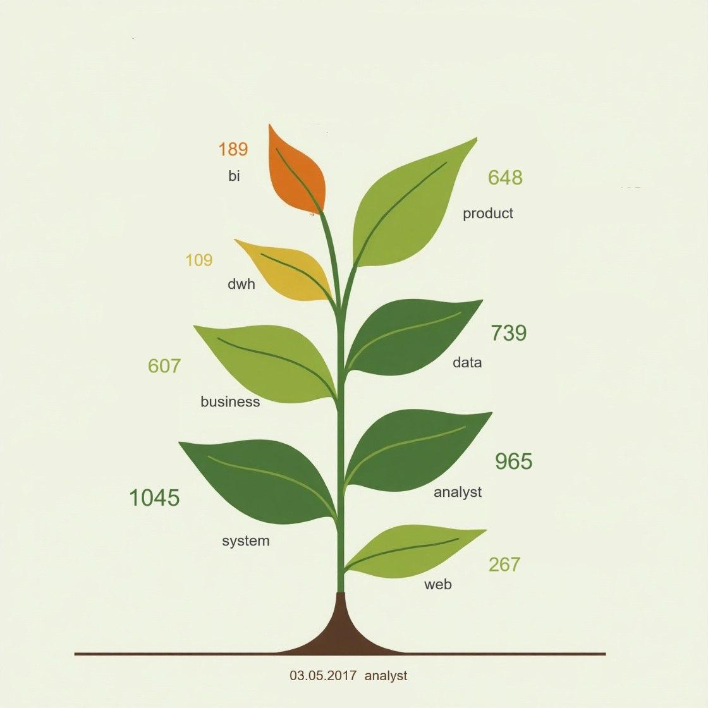

# Эволюция аналитических ролей (Dataviz)

## Цель
Показать, как роли в аналитике данных развиваются и разделяются на специализированные направления.

## Данные
- Источник: датасет вакансий (CSV)
- Поля: название позиции, теги, категория роли

## Подход
- Выделение ролей, связанных с аналитикой
- Классификация по направлениям (BI, Data, ML и др.)
- Ручное обогащение тегов при необходимости
- Визуализация в виде древовидной (ветвящейся) структуры

## Дашборд

## Ключевые инсайты
- Роли в аналитике развиваются через специализацию
- Базовая роль (Data Analyst) разделяется на несколько направлений
- Технические роли (Data Engineer, ML) сильнее удаляются от ядра, чем бизнес-ориентированные

## Результат
- Визуально показана логика развития профессий в аналитике
- Сформировано понимание карьерных траекторий
- Проект оформлен в виде визуального приложения (изображения)

## Инструменты
Dataviz, CSV-анализ