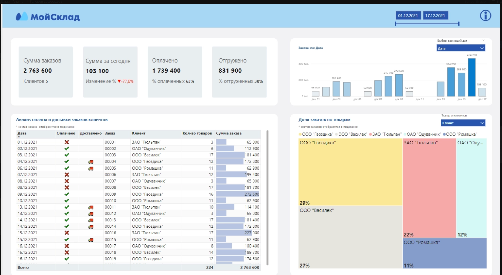
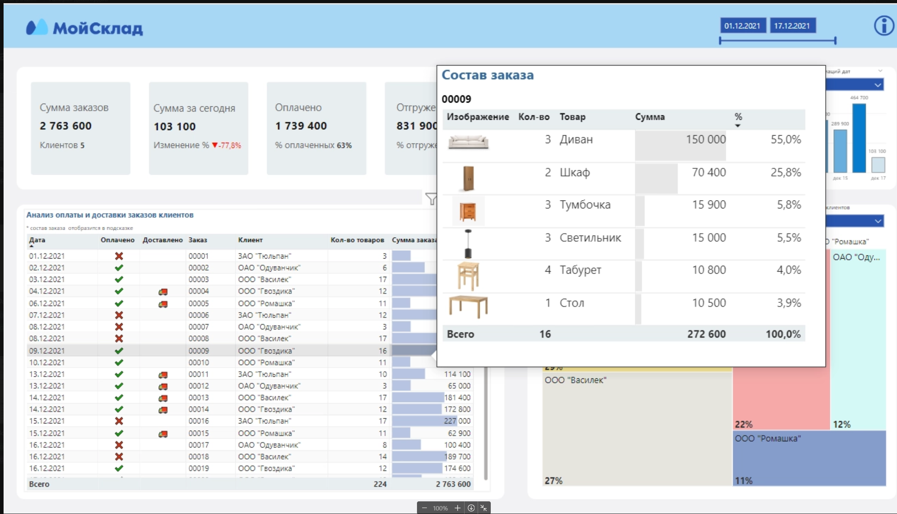
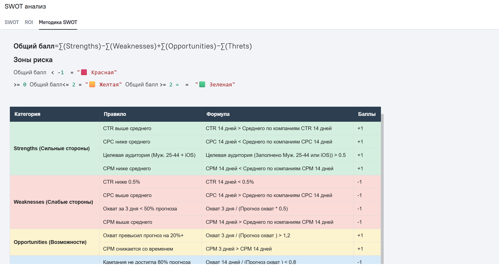
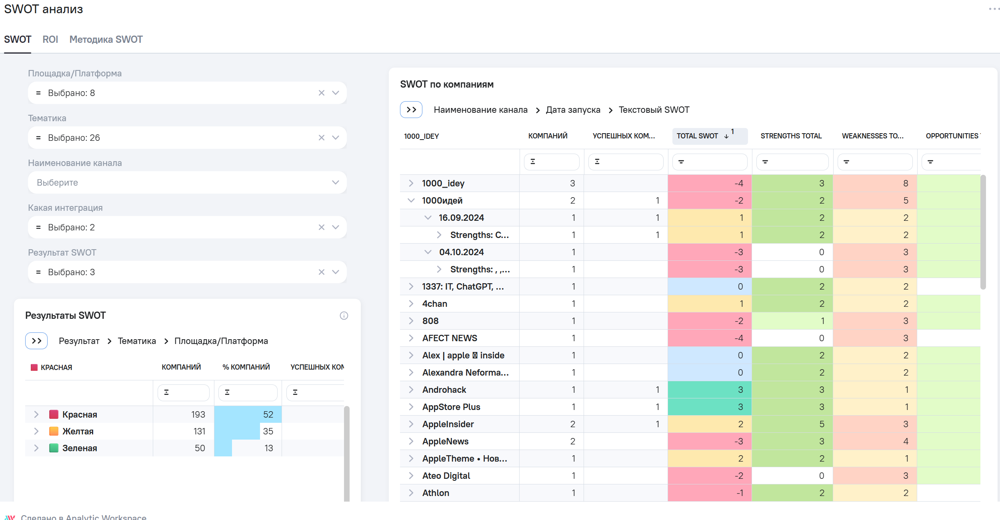

# Оптимизация складской логистики (Power BI)

## Цель
# Анализ складских операций и выявление неэффективностей в логистическом потоке.

## Контекст
Проект получил **приз зрительских симпатий за лучшую визуализацию**  
(организатор — Мария Гришина).

## Данные
- Источник: логистический датасет (CSV)
- Сущности: отгрузки, зоны хранения, этапы обработки
- Метрики: объем, время обработки, пропускная способность

## Подход
- Моделирование данных в Power BI (факт + измерения)
- Построение метрик для анализа потоков (объем, задержки, загрузка)
- Визуализация этапов складского процесса
- Фокус на поддержке операционных решений

 
## Ключевые инсайты
- Выявлены узкие места на промежуточных этапах хранения
- Обнаружен дисбаланс загрузки между зонами склада
- Найдены неэффективности в переходах между этапами обработки

## Результат
- Повышена прозрачность складских операций
- Определены зоны для оптимизации процессов
- Проект отмечен призом зрительских симпатий

## Артефакты
- Power BI файл: `Warehouse operations.pbix`

## Инструменты
Power BI, CSV

## Визуализация

# SWOT-анализ маркетинговых каналов (Power BI)

## Описание метрики

Реализована модель оценки маркетинговых каналов на основе подхода **SWOT (Strengths, Weaknesses, Opportunities, Threats)**.

Каждый канал автоматически анализируется по ключевым метрикам эффективности:

- **CTR (кликабельность)**
- **CPC (стоимость клика)**
- **CPM (стоимость тысячи показов)**
- **Охват (выполнение плана и динамика)**

На основе заданных бизнес-правил формируются бинарные индикаторы (1/0), отражающие наличие:

- **Сильных сторон (Strengths)** — эффективность выше среднего
- **Слабых сторон (Weaknesses)** — отклонения и проблемы
- **Возможностей (Opportunities)** — потенциал роста
- **Угроз (Threats)** — риски ухудшения результатов

Далее рассчитывается итоговый индекс:
Total SWOT = Strengths − Weaknesses + Opportunities − Threats

Результат классифицируется в понятный статус:

- 🟩 **Зеленая зона** — канал эффективен, можно масштабировать  
- 🟨 **Желтая зона** — нейтрально, требуется контроль  
- 🟥 **Красная зона** — проблемы, требуется вмешательство  

Дополнительно формируется текстовое описание причин (SWOT breakdown).

---

## Бизнес-цель

### 1. Стандартизация оценки каналов
Обеспечить единый подход к анализу эффективности маркетинга на основе KPI, исключив субъективность.

### 2. Ускорение принятия решений
Сократить время анализа за счет автоматической классификации каналов (traffic light model).

### 3. Прозрачность причин результата
Позволить бизнесу видеть не только итог (хорошо/плохо), но и **конкретные драйверы**:
- стоимость
- вовлеченность
- выполнение плана
- динамика показателей

### 4. Оптимизация распределения бюджета
- масштабирование эффективных каналов (🟩)
- оптимизация средних (🟨)
- остановка или переработка неэффективных (🟥)

### 5. Раннее выявление рисков
Фиксация негативных сигналов на ранних этапах (например, низкий охват за первые дни или рост CPM) для проактивного управления кампаниями.

---

## Краткое резюме

Модель переводит разрозненные маркетинговые KPI в единый интегральный индекс и визуальный статус, позволяя быстро и обоснованно принимать решения по управлению каналами и бюджетом.

## Артефакты
- Power BI файл: `SWOT.pbix`

## SWOT Визуализация

